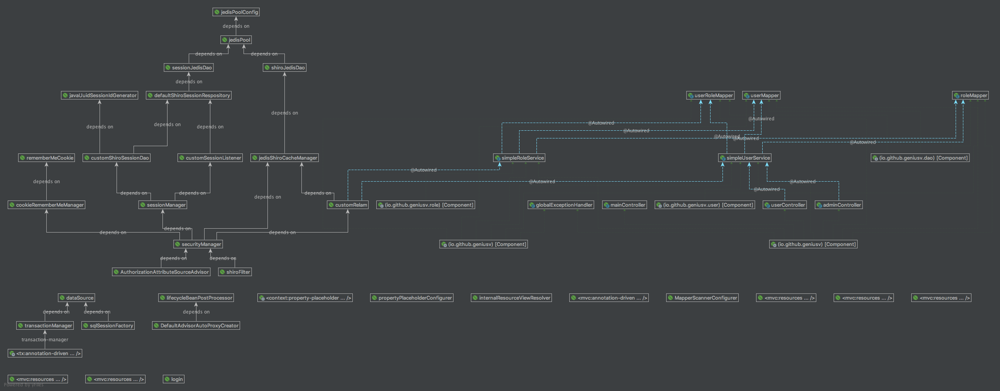

## Cached Demo

This is an integration demo of Spring MVC.

## Features
- Store Shiro cache in Redis.(DB 0)
- Use Shiro manage sessions and cache them in Redis.(DB 1)
- Enable Mybatis second level cache and store them in Redis.(DB 2)
- Shiro-based authorization and authentication.
- Frequently-used mapping generation with Mybatis Generator and custom plugins.

## Usage
1. config `jdbc.properties` and `redis.properties`. The `redis.properties` is for Mybatis cache use. The other two are configured in `spring-redis.xml`.
2. run `init.sql`.
3. make sure your redis is running.
4. It is ready to run!

## Structure

